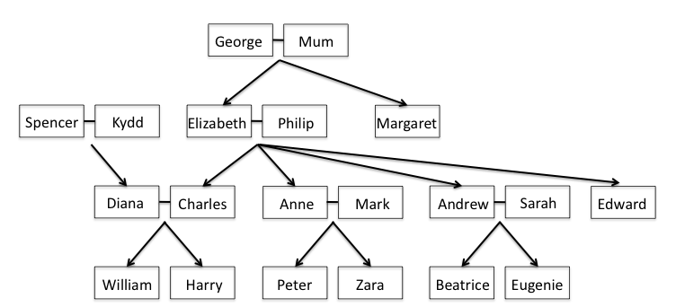

# Prolog_family_tree

Question:
1.	Enter the information from this family tree as a set of Prolog facts. Note that the females are Mum, Kydd, Elizabeth, Margaret, Diana, Anne, Sarah, Zara, Beatrice, and Eugenie.

2.	Add CLIPS rules that will allow you to infer information for the predicates grandChild, greatGrandparent, brother, sister, daughter, son, aunt, uncle, brotherInLaw, sisterInLaw, and firstCousin. You may create rules for additional predicates if you find that helpful.

3.	Test your CLIPS program by asking it who are Elizabeth’s grandchildren, Diana’s brothers-in-law, and Zara’s great-grandparents. Note, in some cases, it may be impossible to avoid getting the same answer more than once for a query.
